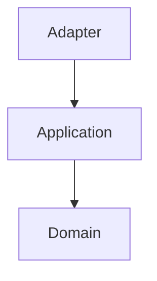
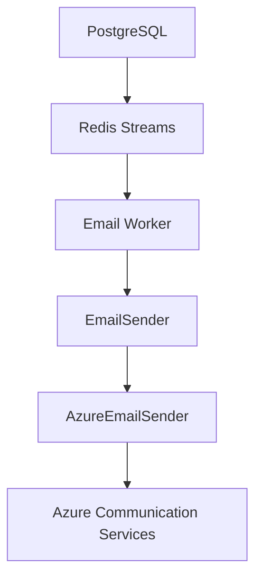
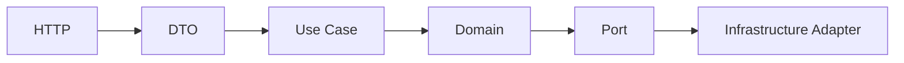

# Motor Desk - Copilot Code Review Instructions

## Review Objective

Review every pull request for correctness, security, architectural consistency, domain correctness, test coverage,
maintainability, API compatibility, and documentation consistency.

Prioritize actionable findings over stylistic preferences. Do not report speculative problems without explaining the
concrete risk.

## Project Context

Motor Desk is a Kotlin/Ktor backend for automotive repair shop management following DDD and Clean/Hexagonal
Architecture.

Relevant documentation:

- `AGENTS.md` — general AI-agent project guidance.
- `README.md` — project overview and high-level architecture.
- `docs/Ubiquitous Language.md` — domain vocabulary.
- `docs/ADR/` — architectural decisions.
- `docs/storytelling/` — business flows.
- `docs/index.html` — static OpenAPI documentation.
- `bruno/` — manual API testing.

Before reviewing a non-trivial change, inspect the relevant documentation.

## Architecture

Respect:

The domain must not depend on Ktor, Exposed, Redis/Lettuce, MongoDB drivers, Azure SDKs, HTTP clients, or adapter
configuration.

External providers must be isolated behind appropriate abstractions and adapter adapters.

## Domain

Use the project's Ubiquitous Language from `docs/Ubiquitous Language.md`.

Pay special attention to:

- `ServiceOrder`
- `ServiceOrderStatus`
- `Client`
- `Operator`
- `Manager`
- `Task`
- `InventoryItem`

Business rules should remain outside HTTP controllers and adapter adapters.

## Persistence

### PostgreSQL

PostgreSQL is the transactional source of truth. Use Kotlin Exposed according to existing conventions.

### MongoDB

MongoDB is used for Service Order history and snapshots. Do not use it as a replacement for transactional state without
an architectural decision.

### Redis Streams

Redis Streams is used for asynchronous processing. Redis must not become the business source of truth.

## Email

Expected architecture:

Review email changes for:

- state being persisted before asynchronous processing;
- Redis being transport, not business truth;
- worker loading authoritative data from PostgreSQL;
- Azure being isolated behind `EmailSender`;
- Azure SDK types not leaking into domain/application;
- persisted and bounded retry count;
- no hardcoded provider credentials;
- duplicate delivery risks being considered.

The documented email retry policy is a maximum of three attempts.

## API

Routes should remain thin:

Do not put business rules, SQL, Redis commands, or Azure SDK calls directly in routes.

When an API contract changes, check OpenAPI/Swagger, Bruno, and related documentation.

## Security

Flag hardcoded credentials, API keys, access keys, tokens, passwords, committed secrets, unsafe token generation,
missing validation, authorization bypasses, and sensitive information in logs.

For tokenized Service Order approval URLs, verify unpredictability, expiration, revocation/reuse controls, and
authorization where applicable.

## Testing

New behavior should have appropriate tests. For critical flows check success, failure, validation, authorization,
persistence, retry, and external integration boundaries.

Do not consider a PR complete solely because it compiles.

## Documentation

When a PR changes:

- domain terminology → `docs/Ubiquitous Language.md`
- business flow → `docs/storytelling/`
- architecture → `docs/ADR/`
- API contract → OpenAPI / Swagger
- manual API usage → `bruno/`
- high-level architecture → `README.md`

Do not duplicate detailed documentation inside this file.

## Architectural Decisions

Check `docs/ADR/` for persistence, messaging, external providers, architectural boundaries, security model, or major
adapter decisions.

Do not request an ADR for ordinary implementation details.

## Review Severity

Use:

- **[P0] Critical** — must be fixed before merge.
- **[P1] High** — strongly recommend fixing before merge.
- **[P2] Medium** — should be fixed, but may be acceptable depending on context.
- **[P3] Low** — minor improvement or maintainability suggestion.

Only report actionable findings. For each finding explain what is wrong, why it matters, where it occurs, and how to fix
it.

## Review Behavior

- Prioritize correctness and architectural problems.
- Do not request changes merely because another implementation is possible.
- Do not suggest unrelated refactoring.
- Prefer small, focused changes.
- Respect existing architectural decisions unless there is a concrete reason to change them.
- When documentation and implementation disagree, identify the discrepancy rather than silently assuming which is
  correct.
