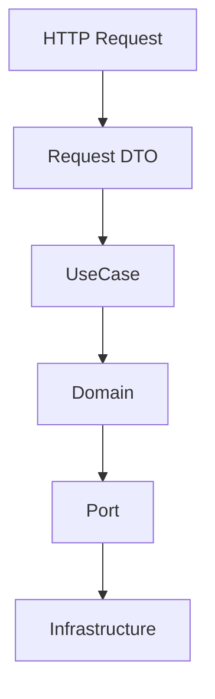

# Motor Desk - API Review

Review HTTP/API changes for contract stability, security, and architectural boundaries.

## Route Responsibilities

Do not put SQL, Redis commands, Azure SDK calls, or complex business rules inside route handlers.

## Ktor Resources

The project uses Ktor Resources for type-safe routing and reverse URL generation. Keep `@Resource` and URL-building
concerns in the HTTP/infrastructure boundary. Do not introduce Ktor Resources into domain models.

## API Contracts

Check HTTP method, path, parameters, request/response bodies, status codes, validation, authentication, authorization,
and error responses.

Check whether OpenAPI documentation must be updated.

## Security-sensitive URLs

For tokenized Service Order approval:

- do not expose unnecessary internal identifiers;
- use unpredictable tokens;
- validate expiration and status;
- consider one-time use/revocation;
- do not log raw bearer-style tokens;
- do not put sensitive data directly into URL parameters.

## Documentation

For API changes, consider `docs/index.html`, Swagger/OpenAPI configuration, `postman/`, and `README.md`.
