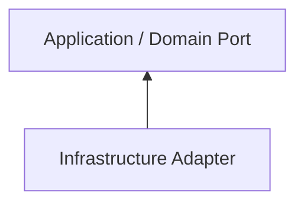

# Motor Desk - Infrastructure Review

Review infrastructure implementations for correct adapter boundaries, reliability, and configuration safety.

## Architecture

Infrastructure implements capabilities required by application/domain abstractions.

Do not expose infrastructure implementation details upward.

## PostgreSQL / Exposed

PostgreSQL is the transactional source of truth. Check transaction boundaries, constraints, nullability, indexes,
migrations, domain/persistence mapping, and existing Exposed conventions.

## MongoDB

MongoDB is used for Service Order history and snapshots. Keep historical responsibilities separate from transactional
state.

## Redis / Lettuce

Redis Streams is used for asynchronous processing. Check stream names, consumer groups, acknowledgment, pending
messages, errors, retries, payload shape, coroutine usage, and accidental Pub/Sub semantics.

Redis is not the business source of truth.

## Azure Communication Services

Check that Azure SDK code remains in infrastructure, credentials come from configuration/secrets, provider errors are
handled, `EmailSender` remains the application-facing abstraction, and Azure-specific models do not leak outside
infrastructure.

## Configuration

Never commit access keys, passwords, credential-bearing connection strings, tokens, or production secrets.

## Adapters

Adapters translate between internal models and provider-specific models. Do not leak provider-specific types through
application interfaces.
