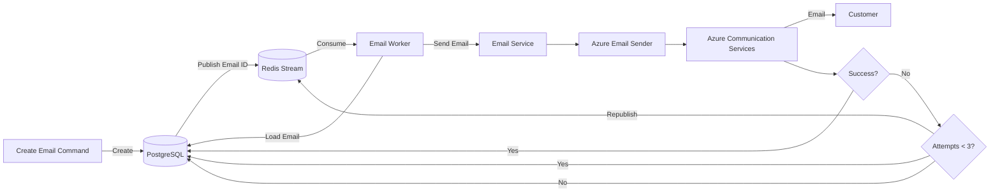

# AGENTS.md — Motor Desk

## 1. Purpose

This file is the operational guide for AI coding agents working on **Motor Desk**.

The goal is to provide enough project context for an agent to make changes that are consistent with the existing
architecture, domain model, coding conventions and documentation strategy.

> **Important:** This file is a guide for implementation work. It must not become a replacement for the project's
> domain, architectural or API documentation.

When detailed information already exists in `docs/`, prefer reading and following that documentation instead of
duplicating it here.

---

## 2. Project Overview

Motor Desk is a backend application for automotive repair shop management.

The system manages:

- customers;
- vehicles;
- Service Orders;
- tasks/services;
- inventory items;
- budgets and customer approval;
- authentication;
- Service Order history;
- asynchronous email notifications.

The application is implemented in **Kotlin** using **Ktor 3** and follows concepts from:

- Domain-Driven Design (DDD);
- Clean Architecture;
- Hexagonal Architecture / Ports and Adapters.

The project currently uses:

- Kotlin;
- Ktor 3;
- PostgreSQL;
- Exposed;
- MongoDB;
- Redis Streams;
- Lettuce;
- JWT;
- Docker Compose;
- OpenAPI / Swagger UI;
- Azure Communication Services for email delivery;
- Konform for validation;
- Sqids for public-facing identifiers.

The current README documents the technology stack and the high-level architecture. See `README.md`.

---

## 3. Source of Truth and Documentation

Before implementing a non-trivial change, inspect the relevant existing documentation.

### 3.1 README

`README.md`

Use it for:

- project overview;
- technology stack;
- high-level architecture;
- adapter;
- asynchronous email flow;
- business flow index;
- API documentation;
- local development instructions;
- project structure.

The README intentionally acts as an entry point and should not duplicate detailed architectural decisions.

### 3.2 Ubiquitous Language

`docs/Ubiquitous Language.md`

This is the source of truth for the project's domain vocabulary.

Use the terminology defined there when naming:

- classes;
- interfaces;
- methods;
- use cases;
- DTOs;
- events;
- database concepts;
- documentation.

Do not introduce alternative names for existing domain concepts without a clear reason.

Relevant domain concepts include:

- `ServiceOrder`
- `Task`
- `InventoryItem`
- `Client`
- `Operator`
- `Manager`
- `ServiceOrderStatus`

### 3.3 Architecture Decision Records

`docs/ADR/`

Architecture Decision Records contain the rationale for important technical decisions.

Existing ADRs include decisions around:

- Redis Streams for asynchronous processing;
- MongoDB for Service Order history.

When changing an existing architectural decision, read the corresponding ADR first.

When introducing a new architectural decision that is:

- difficult to reverse;
- cross-cutting;
- externally visible;
- adapter-related;
- a significant trade-off;

consider creating or updating an ADR instead of documenting the decision only in code.

Do not rewrite an ADR merely because the implementation changed accidentally. First determine whether the architectural
decision itself changed.

### 3.4 Domain Storytelling

`docs/storytelling/`

Business processes are represented using Domain Storytelling / Draw.io diagrams.

Current flows include:

- Login / Registration;
- Service Order;
- Vehicle Registration;
- Forgot Password.

When modifying a business flow, check whether the corresponding storytelling diagram needs to be updated.

Do not invent domain behavior that contradicts these flows.

### 3.5 OpenAPI

`docs/index.html`

This contains the static OpenAPI documentation.

The running API is exposed through Swagger UI at:

`http://127.0.0.1:8080/swaggerUI`

When changing an HTTP endpoint:

1. inspect the existing endpoint contract;
2. preserve existing API semantics unless the task explicitly requires a breaking change;
3. update OpenAPI-related documentation if necessary;
4. verify Swagger when practical.

### 3.6 Bruno

`bruno/`

Use the Bruno collection for manual API testing and for understanding existing endpoint usage.

If an endpoint contract changes, consider whether the corresponding collection needs to be updated.

### 3.7 Project Delivery Documentation

The repository also contains project delivery documentation describing the implemented scope and the relationship
between the README, ADRs, storytelling, OpenAPI and Bruno documentation.

Use it as supporting documentation, not as a replacement for source code or ADRs.

---

## 4. Architectural Principles

### 4.1 Dependency direction

Dependencies should point toward the domain.

Conceptually:

```text
Infrastructure
      ↓
Application
      ↓
Domain
```

The domain must not depend on infrastructure implementations.

Avoid importing infrastructure concerns into:

- domain models;
- domain ports;
- domain business rules.

### 4.2 Domain

The `domain/` layer should contain:

- domain models;
- value objects;
- domain rules;
- domain-level ports/interfaces;
- abstractions required by the business.

Keep infrastructure-specific implementations outside this layer.

For example, an abstraction such as an email sender may belong to the domain/application boundary while the Azure
Communication Services implementation belongs to infrastructure.

### 4.3 Application

The `application/` layer contains use-case implementations.

Use cases should:

- orchestrate domain behavior;
- coordinate ports;
 - avoid direct dependency on infrastructure implementations;
- avoid containing HTTP-specific concerns;
- avoid containing provider-specific SDK code.

### 4.4 Infrastructure

The `infrastructure/` layer contains adapters and technical implementations, including:

- Ktor HTTP;
- PostgreSQL / Exposed;
- MongoDB;
- Redis;
- email providers;
- JWT/security;
- dependency injection;
- external integrations.

Provider SDKs such as Azure Communication Services belong here.

---

## 5. Persistence Rules

### PostgreSQL

PostgreSQL is the primary transactional database.

It should be treated as the source of truth for transactional state.

Exposed is used for database access.

The project uses Kotlin-oriented database definitions and migrations. Follow the existing Exposed conventions before
introducing another persistence style.

Do not move transactional state to MongoDB merely because the data is document-shaped.

### MongoDB

MongoDB is used for Service Order history.

Its purpose is historical/audit data and snapshots rather than replacing PostgreSQL as the transactional source of
truth.

Read the MongoDB ADR before modifying this responsibility.

### Redis Streams

Redis Streams are used for asynchronous event processing, particularly email notifications.

Do not treat Redis as the permanent source of business truth.

The email queue state is persisted in PostgreSQL and Redis is used to trigger asynchronous processing.

---

## 6. Asynchronous Email Architecture

The email architecture is intentionally asynchronous.

The conceptual flow is:



### Important rules

1. The API should not synchronously depend on Azure email delivery for the main business operation.
2. Email information is persisted before asynchronous processing.
3. Redis carries the event/trigger used by the worker.
4. The worker loads the persisted email information.
5. Email provider details must remain behind an abstraction.
6. Azure Communication Services SDK usage belongs to adapter.
7. Failed sends are retried up to the configured maximum, currently represented as three attempts in the documented
   flow.
8. The final database state must reflect whether processing succeeded or exhausted retries.
9. Do not put Azure SDK types in domain models.
10. Do not couple domain logic directly to `EmailAsyncClient`.

### Email abstractions

Prefer a structure similar to:

```text
Domain/Application
    EmailSender
        ↓
Adapter
    AzureEmailSender
        ↓
    EmailAsyncClient
```

`EmailMessage` / `EmailMessageBody` should represent application/domain data rather than Azure SDK request objects.

Adapters are responsible for translating internal email models into provider-specific SDK models.

---

## 7. Error Handling and Retries

Email delivery is an external operation and can fail independently of the application.

When implementing retry behavior:

- persist the attempt count;
- distinguish transient failures from terminal failures when the provider/API allows it;
- avoid infinite retries;
- preserve the original email identifier;
- keep the persisted email state consistent;
- record an actionable error message;
- ensure retry publication does not accidentally create duplicate business emails.

Do not silently swallow provider exceptions.

Logging should provide enough context to diagnose a failed email without logging secrets or sensitive credentials.

---

## 8. Kotlin Coding Guidelines

Use idiomatic Kotlin.

Prefer:

- immutable `val`;
- data classes for data carriers;
- sealed types when modeling closed result/error states;
- nullable types instead of sentinel values;
- extension functions when they improve readability;
- small cohesive functions;
- explicit domain types/value objects for important concepts.

Avoid:

- unnecessary mutable state;
- `!!` when safe alternatives exist;
- leaking adapter types across boundaries;
- large use cases that mix HTTP, persistence and external provider concerns;
- generic utility classes that hide domain behavior.

Follow the existing project's naming and package conventions before introducing a new pattern.

---

## 9. Domain Models and DTOs

Keep the distinction between:

- domain models;
- application commands/queries;
- persistence entities;
- HTTP DTOs;
- external provider models.

Do not reuse an adapter DTO as a domain object just because its fields happen to match.

For transformations, prefer explicit adapters/mappers when crossing architectural boundaries.

Example:

```text
EmailQueueItem
      ↓
EmailMessageBody
      ↓
Azure Communication Services request
```

Each transformation should make the boundary explicit.

---

## 10. Validation

The project uses **Konform** for validation.

Validation should be placed at the appropriate boundary:

- HTTP/input validation for request-shape concerns;
- domain validation for business invariants;
- persistence constraints for database integrity.

Do not move business rules into HTTP controllers merely to make request validation convenient.

---

## 11. API Guidelines

Ktor routes/controllers should remain thin.

A typical flow should resemble:

```text
HTTP Request
    ↓
DTO
    ↓
Use Case
    ↓
Domain
    ↓
Port
    ↓
Infrastructure Adapter
```

Avoid putting:

- SQL queries;
- Redis commands;
- Azure SDK calls;
- complex business rules;

directly in HTTP handlers.

When modifying an endpoint, verify:

- request DTO;
- response DTO;
- validation;
- authentication/authorization;
- use case;
- error mapping;
- OpenAPI documentation;
- Bruno collection when applicable.

---

## 12. Dependency Injection

Follow the existing DI composition instead of creating ad-hoc global instances.

The application bootstrap currently composes infrastructure and application dependencies before configuring HTTP.

When adding a new adapter:

1. define the appropriate abstraction;
2. implement the adapter in infrastructure;
3. register it in the existing DI mechanism;
4. inject the abstraction into the consumer;
5. avoid constructing infrastructure dependencies inside use cases.

---

## 13. Testing

Before considering a change complete:

```bash
./gradlew test
```

For broader validation:

```bash
./gradlew build
```

Tests should focus on behavior and architectural boundaries.

For email-related changes, prioritize tests for:

- email model mapping;
- retry behavior;
- success/failure state transitions;
- worker behavior;
- adapter behavior;
- provider failure handling.

Avoid tests that unnecessarily depend on a real Azure Communication Services account unless the test is explicitly an
integration test.

---

## 14. Local Development

The project uses Docker Compose for local infrastructure.

Typical startup:

```bash
docker compose up -d
./gradlew run
```

On Windows:

```bash
gradlew.bat run
```

Development secrets are configured from:

```text
src/main/resources/secrets.properties.example
```

Never commit real credentials.

For Azure Communication Services, credentials and connection information must be supplied through the project's
secret/configuration mechanism.

---

## 15. Documentation Rules for Agents

Documentation is part of the implementation.

When making a change, decide whether it affects:

| Change                  | Documentation to consider             |
|-------------------------|---------------------------------------|
| Domain terminology      | `docs/Ubiquitous Language.md`         |
| Business flow           | `docs/storytelling/`                  |
| Architectural decision  | `docs/ADR/`                           |
| API contract            | OpenAPI / Swagger                     |
| Manual API test         | `bruno/`                              |
| High-level architecture | `README.md`                           |
| Email architecture      | Email ADR + README/flow documentation |

### Avoid duplication

Do not copy the full contents of an ADR into `AGENTS.md` or `README.md`.

Do not copy the full Ubiquitous Language into `AGENTS.md`.

Do not copy complete business stories into `AGENTS.md`.

Instead, explain **when the agent should consult each document** and reference it.

---

## 16. When to Create an ADR

Create an ADR when the implementation introduces or changes an important architectural decision.

Examples:

- replacing Redis Streams;
- changing the persistence strategy;
- introducing a new database;
- changing the email provider;
- changing the email delivery reliability model;
- introducing a new cross-cutting adapter dependency;
- changing a major architectural boundary.

Do not create an ADR for ordinary implementation details such as:

- renaming a class;
- extracting a method;
- adding a unit test;
- changing a local mapper;
- fixing a typo.

---

## 17. Git and Change Scope

Keep changes focused.

Before editing:

1. inspect the relevant source code;
2. inspect related tests;
3. inspect relevant documentation;
4. identify architectural boundaries;
5. identify whether an ADR or documentation update is necessary.

Avoid unrelated refactoring in the same change.

Do not modify generated files unless the task explicitly requires it.

Do not commit secrets, local configuration or credentials.

---

## 18. Recommended Investigation Order

For an unfamiliar task, use this order:

```text
1. README.md
       ↓
2. docs/Ubiquitous Language.md
       ↓
3. Relevant docs/storytelling diagram
       ↓
4. Relevant docs/ADR/*
       ↓
5. Existing use case
       ↓
6. Existing domain port/model
       ↓
7. Existing adapter adapter
       ↓
8. Tests
       ↓
9. Implementation
       ↓
10. Documentation update
```

For email work specifically:

```text
README.md
   ↓
Email flow
   ↓
Redis Streams ADR
   ↓
Email domain/application abstractions
   ↓
Email Worker
   ↓
Azure Email adapter
   ↓
Tests
```

---

## 19. What an Agent Should Not Assume

Do not assume:

- Redis is the source of truth;
- MongoDB replaces PostgreSQL;
- Azure SDK types belong in the domain;
- email sending must happen synchronously;
- every external integration belongs in the application layer;
- a new abstraction is necessary without checking existing ports;
- a business rule is correct merely because it appears convenient;
- an old README or ADR version is necessarily the current implementation.

When documentation and code disagree, investigate the discrepancy before making a broad architectural change.

---

## 20. Definition of Done

A change is considered complete when applicable:

- [ ] The implementation follows the existing architecture.
- [ ] Domain terminology follows the Ubiquitous Language.
- [ ] Adapter dependencies remain behind appropriate boundaries.
- [ ] Tests are added or updated.
- [ ] `./gradlew test` passes.
- [ ] `./gradlew build` passes when appropriate.
- [ ] API documentation is updated for API changes.
- [ ] Storytelling documentation is updated for business-flow changes.
- [ ] An ADR is created/updated for architectural decisions.
- [ ] README references are updated when the high-level architecture changes.
- [ ] No credentials or secrets were introduced.
- [ ] The change is limited to the requested scope.

---

## 21. Quick Reference

```text
Motor Desk
├── domain/
│   ├── domain models
│   ├── value objects
│   └── ports
│
├── application/
│   └── use cases
│
├── adapter/
│   ├── HTTP / Ktor
│   ├── PostgreSQL / Exposed
│   ├── MongoDB
│   ├── Redis / Lettuce
│   ├── Email / Azure Communication Services
│   └── Security / JWT
│
├── docs/
│   ├── ADR/
│   ├── storytelling/
│   ├── Ubiquitous Language.md
│   └── index.html
│
├── bruno/
└── README.md
```

### Documentation map

```text
README.md
  ├── Project overview
  ├── Architecture overview
  ├── Runtime adapter
  └── Getting started
       │
       ├── docs/Ubiquitous Language.md
       │      └── Domain vocabulary
       │
       ├── docs/storytelling/
       │      └── Business flows
       │
       ├── docs/ADR/
       │      └── Architectural decisions
       │
       ├── docs/index.html
       │      └── Static OpenAPI
       │
       └── bruno/
              └── Manual API testing
```

**When in doubt, inspect the existing documentation and implementation before introducing a new pattern.**
