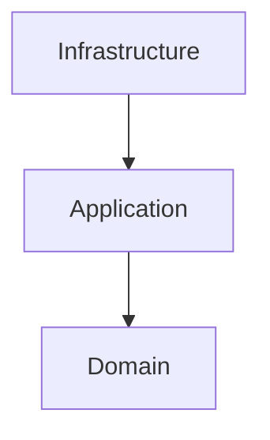
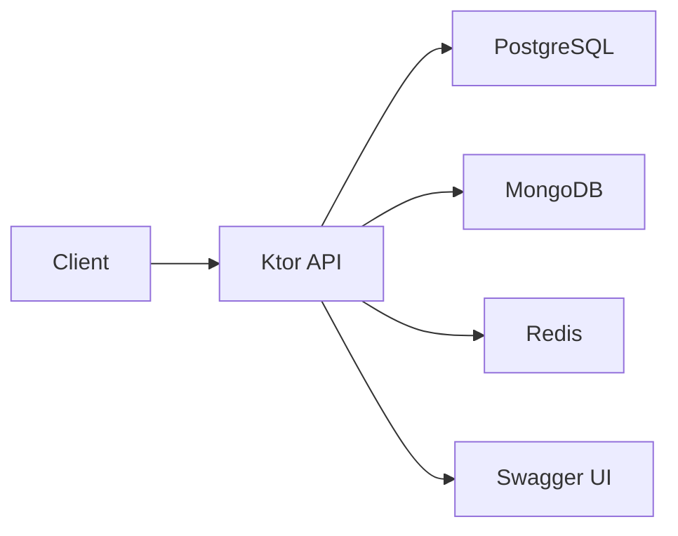
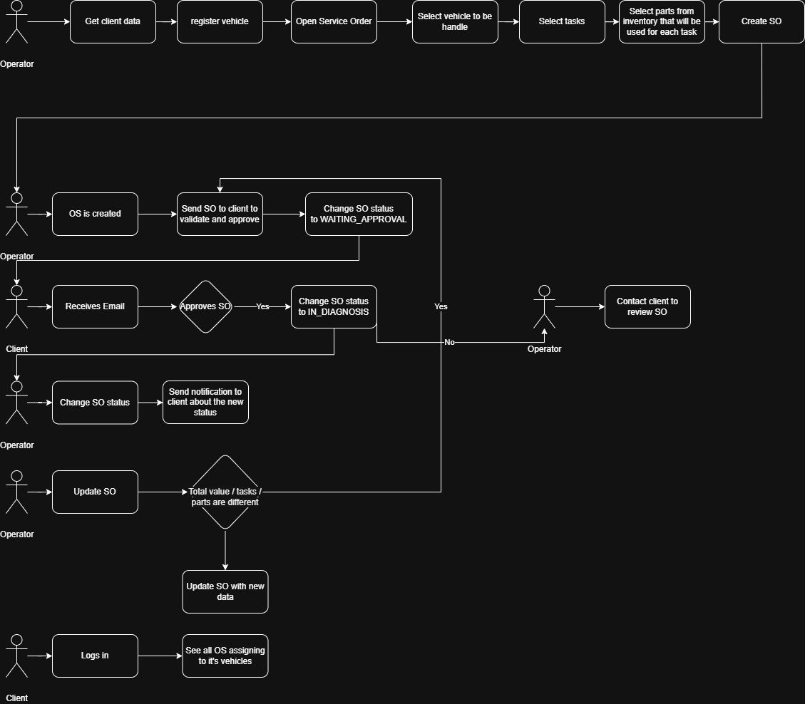
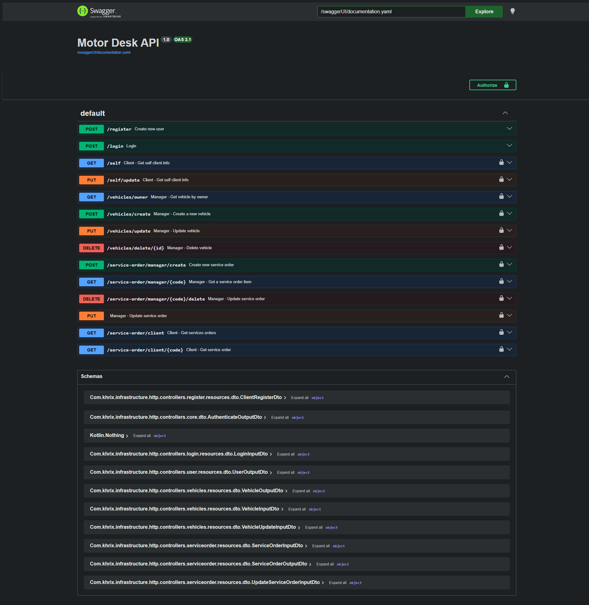
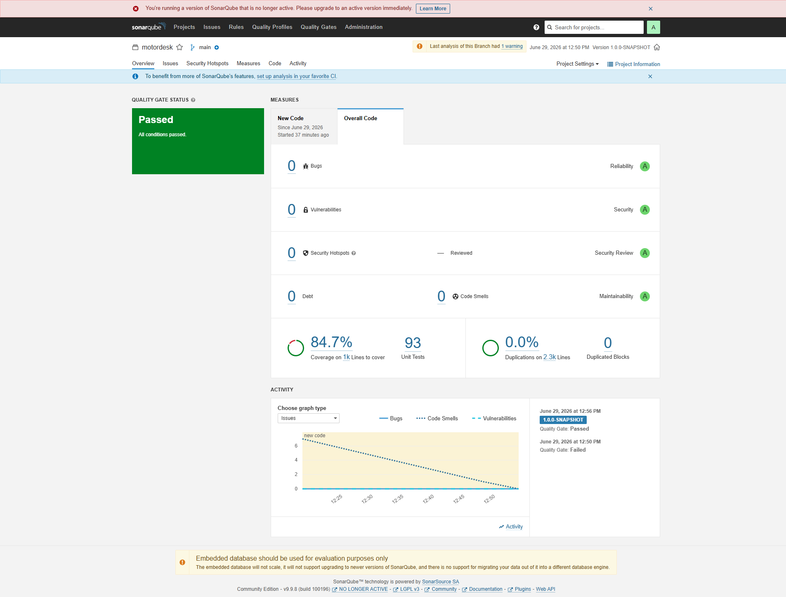

# Motor Desk


 

Backend API for automotive repair shop management built with **Kotlin**
and **Ktor 3**. Motor Desk manages Service Orders, customers, vehicles,
tasks, inventory items, budget approvals and asynchronous email
notifications.

## Technologies

- Kotlin
- Ktor 3
- PostgreSQL + Exposed
- MongoDB (Service Order history)
- Redis Streams (asynchronous email queue)
- JWT Authentication
- Docker Compose
- Sonar
- OpenAPI + Swagger UI

## Ubiquitous Language

- [Ubiquitous Language](docs/Ubiquitous%20Language.md)

## Architecture Decision Records

- [ADR-001 - Redis Streams](docs/ADR/ADR-001-Redis-Streams.md)
- [ADR-002 - MongoDB
  History](docs/ADR/ADR-002-MongoDB-Service-Order-History.md)

## Project Structure

``` text
src/main/kotlin
├── domain
├── application
└── infrastructure

docs
├── ADR
├── Ubiquitous Language.md
├── storytelling
└── index.html

postman
```

## Architecture

### Clean Architecture



### Runtime Infrastructure



### Service Order Flow



More about flows can be found on `docs/storytelling/`**

## Business Flows

Business diagrams are available under `docs/storytelling/`:

- [Login / Registration](docs/storytelling/Login.drawio)
- [Service Order](docs/storytelling/Service%20Order.drawio)
- [Vehicle Registration](docs/storytelling/Vehicle%20registration.drawio)
- [Forgot Password (planned)](docs/storytelling/Forgot%20Password.drawio)

## API Documentation

- Interactive Swagger UI: `http://127.0.0.1:8080/swaggerUI`
- Static OpenAPI: `docs/index.html`

### Swagger UI Preview



### Sonar UI Preview



Cove coverage is only on top of domain and application modules** 

## Running the Project

### Prerequisites

- JDK 21
- Docker
- Docker Compose

### Run on your machine

``` bash
docker compose -f docker-compose-dev.yml up -d
```

``` bash
./gradlew runDev
```

#### Code analyses (only works with docker-compose-dev.yml)

``` bash
./gradlew sonar
```

### Run a product-like build using docker

``` bash
docker compose -f docker-compose.yml up -d
```

### Postman Collection

Postman collection can be loaded up from this repo

### Seed users

Role Login Password
  --------------- -------------------------------- -----------
Customer

- christian.alexsander@email.com
- test@123!

Administrator

- christian.alex@email.com
- test@123!

## Useful Gradle Tasks

Command Description
  ----------------------- ----------------------
`./gradlew runDev`        Run application
`./gradlew test`          Execute tests
`./gradlew sonar`         Execute tests, coverage and upload to local sonar
`./gradlew build`         Full build
`./gradlew buildFatJar`   Build executable JAR

### Other Resources

- Ubiquitous Language: `docs/Ubiquitous Language.md`
- Storytelling diagrams: `docs/storytelling/`
- Static OpenAPI: `docs/index.html`
- Swagger UI screenshot: `docs/swaggerUI.png`
- Postman collection: `postman/`
