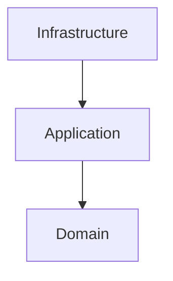

# Motor Desk


Motor Desk is a backend API for automotive repair shop management built with Kotlin and Ktor 3. The codebase follows a
hexagonal style with domain ports, application use cases, and infrastructure adapters. It manages service orders,
customers, vehicles, tasks, inventory items, approvals, authentication, service order history, and asynchronous email
notifications.

## Technologies

- Kotlin
- Ktor 3
- PostgreSQL + Exposed
- MongoDB for Service Order history
- Redis Streams for asynchronous email processing
- JWT authentication
- Docker Compose
- OpenAPI + Swagger UI

## Architecture

### Hexagonal Structure



The main code locations are:

```text
src/main/kotlin
├── domain
├── application
└── infrastructure
```

## Documentation

- [Ubiquitous Language](docs/Ubiquitous%20Language.md)
- [ADR-001 - PostgreSQL + Kotlin Exposed](docs/ADR/ADR-001%20%E2%80%94%20PostgreSQL%20+%20Kotlin%20Exposed.md)
- [ADR-002 - Redis Streams](docs/ADR/ADR-002-Redis-Streams.md)
- [ADR-003 - MongoDB Service Order History](docs/ADR/ADR-003-MongoDB-Service-Order-History.md)
- [ADR-004 - Azure Communication Services Email](docs/ADR/ADR-004-Azure-Communication-Services-Email.md)
- [ADR-005 - Migrating to Hexagonal Architecture](docs/ADR/ADR-005-Migrating-to-Hexagonal-Architecture.md)
- [ADR-006 - Terraform and Microsoft Azure for Infrastructure as Code](docs/ADR/ADR-006-terraform-azure.md)
- [Send Email Sequence](docs/diagrams/send-email-sequence.md)
- [Email Sending with Azure](docs/diagrams/email-sending-azure.md)
- [Technical Debt - Serializable in Domain](docs/Technical-Debt/TD-001-Serializable-in-Domain.md)
- [Business flows](docs/storytelling/)

## Business Flows

- Login / Registration
- Service Order
- Vehicle Registration
- Forgot Password

## API Documentation

- Interactive Swagger UI: `http://127.0.0.1:8080/swaggerUI`
- Static OpenAPI: `docs/index.html`

## Running the Project

### Prerequisites

- JDK 21
- Docker
- Docker Compose
- `kotlinc` (Kotlin compiler) — required for local Terraform testing
- Terraform (for infrastructure provisioning on Azure)

### Local run

```bash
docker compose -f docker-compose-dev.yml up -d
./gradlew runDev
```

### Local Terraform Testing

Motor Desk uses Terraform for Infrastructure as Code (IaC) on Microsoft Azure (see [ADR-006](docs/ADR/ADR-006-terraform-azure.md)).

Local testing of Terraform configurations requires `kotlinc` because the project uses a Kotlin-based orchestration script (`scripts/terraform-local.main.kts`) to automate Terraform workflows. This script:

1. Initializes and applies backend infrastructure (resource groups, storage accounts, containers for Terraform state)
2. Configures Terraform remote state storage on Azure
3. Validates Terraform configurations
4. Plans or applies Azure infrastructure changes

The script is executed by the `terraformLocal` Gradle task, which invokes `kotlinc -script` to run the `.kts` file directly.

**To test Terraform configurations locally:**

```bash
./gradlew terraformLocal
```

This task accepts optional arguments:

```bash
# Plan infrastructure changes for QA environment
./gradlew terraformLocal --environment qa --action plan

# Apply infrastructure changes for production environment
./gradlew terraformLocal --environment prod --action apply --image-tag v1.0.0
```

Available arguments:
- `--environment` (default: `dev`) — deployment environment
- `--image-tag` — container image tag for deployment
- `--action` (default: `plan`) — `plan` or `apply`

**Note:** `kotlinc` must be in your system PATH for the script to execute. Ensure your Kotlin installation is correctly configured.

### Useful Gradle tasks

- `./gradlew test` — run unit and integration tests
- `./gradlew build` — build the project
- `./gradlew sonar` — run SonarQube analysis
- `./gradlew buildFatJar` — create a fat JAR for deployment
- `./gradlew terraformLocal` — test local Terraform configurations (requires `kotlinc`)

## Project Notes

- The application uses Ktor DI at the composition root.
- Domain ports live under `domain/`.
- Use-case implementations live under `application/`.
- Technical integrations live under `infrastructure/`.
- Azure infrastructure is provisioned with Terraform under `infra/terraform/azure/` and is documented in ADR-006.
