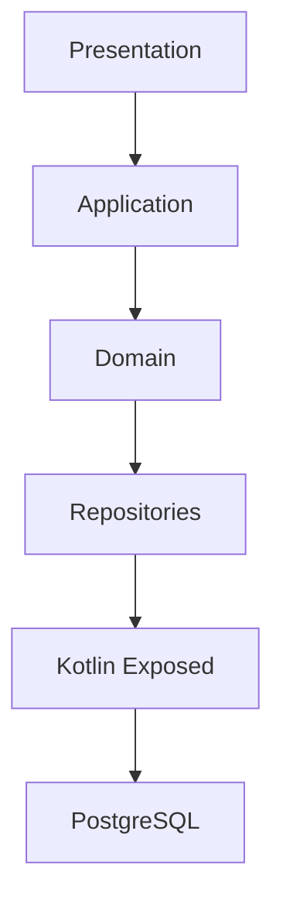

# ADR-001 - PostgreSQL as the Primary Relational Database

## Status

Accepted

---

## Context

Motor Desk is an automotive repair shop management system responsible for handling business-critical operations such as:

* customer management;
* vehicle registration;
* inventory management;
* Service Orders;
* budgets and approvals;
* authentication and authorization.

These operations require strong transactional guarantees, data consistency and relational integrity.

As a consequence, the project required a mature relational database capable of supporting transactional workloads while
remaining simple to deploy and maintain in both development and production environments.

In addition to selecting the relational database, the project also required a persistence technology that integrates
naturally with Kotlin while keeping the codebase expressive and maintainable.

---

## Decision

PostgreSQL was selected as the primary relational database responsible for storing all transactional data.

The persistence layer is implemented using **Kotlin Exposed**, adopting its **Code First** approach and Kotlin DSL for
schema definition and database access.

---

## Motivation

### PostgreSQL

PostgreSQL was chosen because it provides:

* ACID-compliant transactions;
* excellent relational modeling support;
* foreign keys and integrity constraints;
* mature indexing capabilities;
* high performance for transactional workloads;
* strong community support;
* active long-term maintenance;
* native support for advanced SQL features.

Another important factor was the development team's familiarity with PostgreSQL.

Choosing a technology already known by the developer reduced implementation risks, shortened the learning curve and
allowed more time to focus on solving business problems rather than adapter challenges.

Finally, PostgreSQL is an open-source database with a permissive license, making it suitable for academic projects while
also being widely adopted in enterprise environments.

---

### Kotlin Exposed

The project adopts **JetBrains Exposed** as its ORM and SQL framework.

The following characteristics motivated this decision:

* first-class Kotlin support;
* Kotlin DSL instead of XML or annotation-based mappings;
* Code First approach;
* type-safe SQL construction;
* seamless integration with Kotlin language features;
* reduced boilerplate compared to traditional ORM frameworks.

Using Code First allows the database schema to evolve together with the source code, making the persistence model easier
to maintain during development.

The Kotlin DSL also improves readability while preserving direct access to SQL concepts when necessary.

---

## Alternatives Considered

### MySQL

**Advantages**

* widely adopted;
* large ecosystem.

**Disadvantages**

* lower familiarity compared to PostgreSQL;
* fewer advanced SQL features.

**Decision**

Rejected.

---

### MariaDB

**Advantages**

* open source;
* MySQL compatibility.

**Disadvantages**

* smaller ecosystem for Kotlin projects.

**Decision**

Rejected.

---

### SQLite

**Advantages**

* extremely simple deployment.

**Disadvantages**

* unsuitable for concurrent multi-user applications.

**Decision**

Rejected.

---

### Hibernate / JPA

**Advantages**

* mature ecosystem;
* large community.

**Disadvantages**

* annotation-heavy programming model;
* less idiomatic Kotlin support;
* higher complexity;
* additional abstraction over SQL.

**Decision**

Rejected in favor of Kotlin Exposed.

---

## Consequences

### Positive

* robust transactional consistency;
* strong relational integrity;
* expressive Kotlin DSL;
* excellent IDE support;
* type-safe persistence layer;
* simplified schema evolution using Code First;
* reduced impedance mismatch between Kotlin and SQL.

### Negative

* tighter coupling to the Exposed DSL;
* smaller community compared to Hibernate;
* Code First requires disciplined migration management.

---

## Architecture

---

## Scope

PostgreSQL is responsible for storing all transactional data, including:

* users;
* vehicles;
* inventory;
* available tasks;
* Service Orders;
* authentication data.

Historical snapshots and asynchronous messaging are intentionally delegated to other technologies, as documented in
subsequent ADRs.
