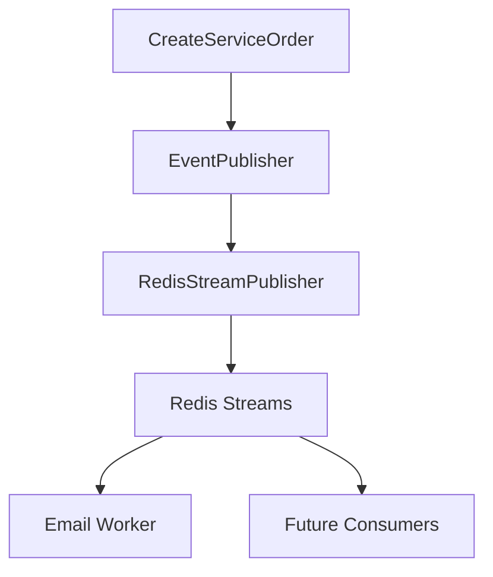
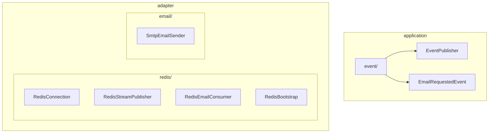

# ADR-002 - Using Redis Streams for Asynchronous Notification Processing

## Status

Accepted

------------------------------------------------------------------------

## Context

The **MotorDesk** system must send email notifications to customers at several stages of the Service Order lifecycle,
including:

- Service Order creation;
- Budget approval request;
- Service completion;
- Vehicle delivery.

Sending emails is a slow operation that depends on external services (SMTP or email providers). Performing this
operation during the HTTP request would:

- increase API response time;
- make the main feature dependent on email provider availability;
- increase coupling between business logic and notification adapter.

Future notifications may also include WhatsApp, Push Notifications, external integrations, and audit events.

Therefore, an asynchronous messaging solution was required to decouple notification processing from business logic.

## Decision

Redis Streams was selected as the asynchronous messaging mechanism.

The application publishes events to a Redis Stream after creating or updating a Service Order. One or more workers in
the **email-workers**
consumer group consume these events and send emails using the Lettuce coroutine API.

## Architecture

## Adopted Structure

## Flow

1. Create the Service Order.
2. Persist it in PostgreSQL.
3. Publish an event to the `service-order-email` stream.
4. Consume it with `XREADGROUP`.
5. Send the email.
6. Acknowledge processing with `XACK`.

## Alternatives Considered

### Redis Pub/Sub

**Pros**

- Simple implementation
- Low latency

**Cons**

- Messages are lost if no subscriber is connected.
- No persistence or acknowledgements.

**Decision:** Rejected.

### Redis Lists

**Pros**

- Simple
- Persistent queue

**Cons**

- No Consumer Groups
- Manual retry handling

**Decision:** Rejected.

### RabbitMQ

**Decision:** Rejected due to additional adapter complexity.

### Apache Kafka

**Decision:** Rejected due to unnecessary complexity for the project scope.

## Consequences

### Positive

- Loose coupling
- Faster API responses
- Multiple consumers
- Persistent messages
- Explicit acknowledgements (`XACK`)

### Negative

- Consumer Group initialization required
- Operational complexity
- Pending Entries monitoring

## Implementation Notes

- Use Redis Streams.
- Create streams using `MKSTREAM`.
- Create Consumer Groups during application bootstrap.
- Use the `email-workers` group.
- Use Lettuce coroutine API (`connection.coroutines()`).
- Serialize events as JSON.
- Acknowledge only after successful email delivery.

## Published Events

- `ServiceOrderCreated`
- `BudgetWaitingApproval`
- `ServiceOrderFinished`

## Architectural Motivation

This decision follows:

- Layered Architecture
- Domain-Driven Design (DDD)
- Single Responsibility Principle
- Event-Driven Architecture
- Horizontal scalability
- Separation between transactional operations and integrations
