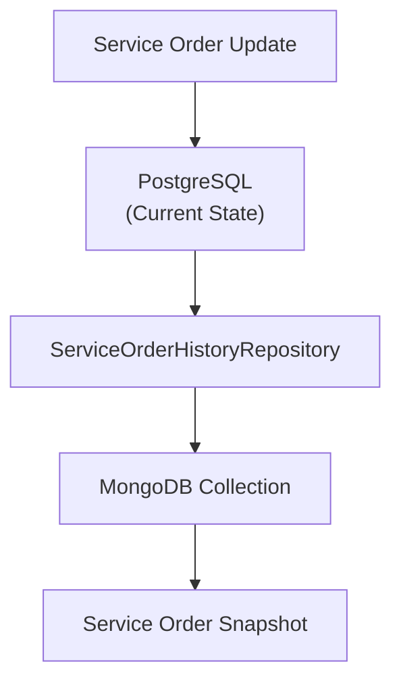

# ADR-003 - Using MongoDB for Service Order Update History

## Status

Accepted

------------------------------------------------------------------------

## Context

The Service Order is the main business entity in MotorDesk. During its lifecycle it changes frequently:

- status updates;
- task additions/removals;
- inventory changes;
- budget updates;
- diagnosis updates;
- customer approval.

Besides the current state, the system must preserve a complete history for auditing and traceability without impacting
transactional performance.

## Decision

MongoDB will store snapshots of the Service Order whenever a relevant update occurs.

Each document represents the complete state of a Service Order at a specific point in time.

PostgreSQL remains the system of record for transactional data.

## Architecture



## Document Structure

``` json
{
  "_id": "...",
  "serviceOrder": {
    "id": 123,
    "status": "WAITING_APPROVAL"
  }
}
```

Each update creates a new document, preserving previous versions.

## Alternatives Considered

### PostgreSQL History Tables

**Pros**

- Existing adapter
- Transactional consistency

**Cons**

- Complex schema
- Audit queries affect transactional database

**Decision:** Rejected.

### Event Sourcing

**Decision:** Rejected because it introduces unnecessary complexity.

### MongoDB

**Pros**

- Natural document storage
- No normalization required
- Snapshot-based history
- Horizontal scalability
- Low impact on PostgreSQL

**Cons**

- Data duplication
- Eventual consistency

**Decision:** Accepted.

## Consequences

### Positive

- Complete audit trail
- Independent audit queries
- Easy historical reconstruction
- Flexible schema evolution

### Negative

- Higher storage usage
- Snapshot synchronization
- Intentional data duplication

## Implementation Notes

- MongoDB is used exclusively for history.
- PostgreSQL remains the source of truth.
- Every relevant update generates a new snapshot.
- Access is abstracted by `ServiceOrderHistoryRepository`.
- Mongo implementation lives in `RegisterHistoryRepositoryMongoFactory`.

## Architectural Motivation

This decision aligns with:

- Separation of transactional and audit workloads
- Domain-Driven Design
- Layered Architecture
- Repository single responsibility
- Flexible document storage
- Preservation of historical data without affecting transactional performance
