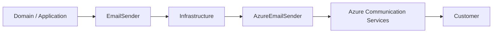
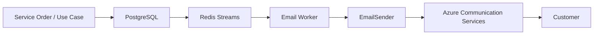
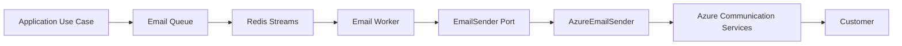
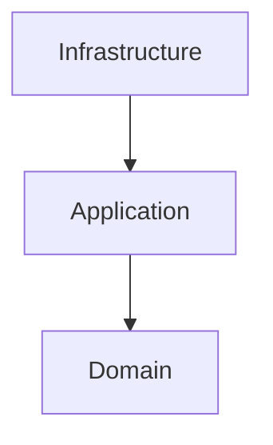
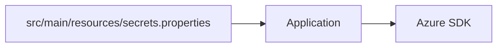
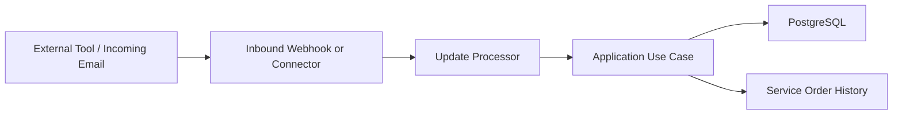

# ADR-004 - Using Azure Communication Services for Transactional Email

## Status

Accepted

## Context

Motor Desk needs to send transactional emails to customers at different points in the lifecycle of a `ServiceOrder`,
including service order creation, budget approval requests, service completion, vehicle delivery, and other business
notifications.

Email delivery depends on an external infrastructure provider and must not be tightly coupled to business rules or to
synchronous HTTP request processing.

The implementation scope also includes an integration point for external tools that can trigger `ServiceOrder` status
updates from inbound messages, such as parsed emails or connector-driven events. Issue #26 requires a documented
mechanism for this inbound flow and at least one working integration test or simulation script that demonstrates a
status update through the chosen mechanism.

The architecture already uses Redis Streams to decouple asynchronous notification processing. That decision is
documented in `docs/ADR/ADR-002-Redis-Streams.md`.

Beyond the messaging mechanism, the system also needs to define the actual email delivery provider.

The main reason for choosing Azure Communication Services is the availability of Azure resources for academic and
student accounts. Azure for Students provides Azure credits and access to Azure services without requiring a credit
card, which allows students to develop, test, and demonstrate applications using real cloud infrastructure.

That makes Azure a practical choice for the current Motor Desk context because it allows the project to use a real
transactional email service without requiring a separate commercial email infrastructure at the start.

This ADR records the motivation for the decision in the context in which it was made. It does not guarantee future
availability, pricing, or student-program terms.

## Decision

Azure Communication Services will be used as the transactional email provider for Motor Desk.

ACS will be used only as an infrastructure implementation for message delivery.

The application must not depend directly on Azure Communication Services types or APIs in the domain or application
layers.

Inbound message-driven status updates remain an application concern and must be exposed through a documented processing
entry point, such as an inbound mail webhook, connector, or worker-based processor. The chosen mechanism must be
testable through an integration test or simulation script.

The integration follows this structure:

The overall processing remains asynchronous, as defined in the Redis Streams ADR:

Azure Communication Services is responsible for email delivery, while Redis Streams remains responsible for asynchronous
decoupling and processing.

## Responsibilities

### Application

The application must:

- create the email send request;
- persist the state required for processing;
- publish the event to the messaging infrastructure;
- process the message asynchronously;
- control retry attempts and processing state.
- expose a documented entry point for inbound message processing when an external tool triggers a `ServiceOrder` status
  update;
- support a reproducible integration test or simulation script for that inbound flow.

### EmailSender

`EmailSender` is the abstraction that represents the ability to send an email without exposing provider details.

It must not know about Azure SDKs, `EmailAsyncClient`, Azure-specific types, or Azure credentials.

### AzureEmailSender

`AzureEmailSender` is the adapter responsible for:

- receiving the application email model;
- translating the internal model into the format expected by Azure;
- using the Azure Communication Services SDK;
- performing the send operation;
- translating provider errors into application-appropriate errors.

### Azure Communication Services

ACS is responsible exclusively for transactional email delivery.

ACS is not the mechanism for inbound status changes. If inbound email is used as the trigger source, the parsing and
status update workflow belongs to the application layer, with the provider-specific transport hidden behind
infrastructure adapters.

## Architecture

The architectural dependency must continue to point inward:

The Azure adapter belongs to infrastructure and must not be referenced directly by the domain.

## Alternatives Considered

### Self-hosted SMTP

Pros:

- full control over the infrastructure;
- independence from a specific provider.

Cons:

- higher operational complexity;
- need to manage an SMTP server;
- reputation and deliverability setup;
- higher maintenance effort;
- not aligned with the goal of keeping the infrastructure simple in an academic context.

Decision: rejected.

### Specialized external email providers

Specialized transactional email services such as SendGrid, Mailgun, Amazon SES, or similar could be used.

Pros:

- specialized services;
- strong delivery infrastructure;
- dedicated transactional email APIs.

Cons:

- another provider added to the ecosystem;
- another account to manage;
- costs and limits depend on the provider;
- less alignment with the Azure infrastructure already available in the academic context.

Decision: rejected for the current context.

### Azure Communication Services

Pros:

- integration with the Azure ecosystem;
- dedicated communication API;
- suitable for transactional email delivery;
- natural fit for applications hosted in Azure;
- possible use of Azure for Students credits and resources;
- no need for a self-hosted SMTP server;
- the provider implementation remains isolated behind an adapter.

Cons:

- dependence on a specific provider;
- dependence on Azure availability and commercial terms;
- technical coupling limited to the infrastructure adapter;
- costs may apply after credits or free-tier allowances are exhausted.

Decision: accepted.

## Consequences

### Positive

- real email delivery infrastructure;
- less operational effort than managing SMTP;
- use of Azure resources available in the academic context;
- provider isolation in the infrastructure layer;
- ability to replace the provider without changing business rules;
- natural fit with the existing asynchronous processing model based on Redis Streams;
- decoupling from synchronous HTTP requests.

### Negative

- dependence on Azure Communication Services;
- exposure to Azure availability, limits, and pricing;
- need to manage Azure credentials and configuration securely;
- a future migration will require a different adapter;
- academic credits must not be treated as a guarantee of permanent zero cost.

## Security and Configuration

Azure Communication Services credentials must not be stored in source code.

Configuration must use the existing mechanism:

The example file must contain only non-sensitive values or placeholders.

Never commit:

- real connection strings;
- access keys;
- tokens;
- credentials;
- production secrets.

The Azure SDK must be instantiated in infrastructure and injected through the existing DI mechanism.

## Resilience

Email delivery continues to be processed asynchronously.

Failures in Azure Communication Services must not block completion of the main business operation.

The worker must:

1. consume the event;
2. load the persisted email data;
3. attempt delivery;
4. record the result;
5. retry when applicable;
6. avoid infinite retries;
7. persist the final state when the retry limit is reached.

The messaging strategy itself remains defined in `docs/ADR/ADR-002-Redis-Streams.md`.

## External Tool Driven Status Updates

Issue #26 adds an adjacent requirement to the email integration work: external tools must be able to drive
`ServiceOrder` status changes.

The exact inbound transport may vary, but the implementation must satisfy these constraints:

- the transport mechanism must be documented;
- the status update must go through an application use case, not a direct database write;
- the mechanism must be demonstrable through an integration test or simulation script;
- the status update must preserve the normal `ServiceOrder` business rules and history recording.

## Impact on the Architecture

| Component                    | Responsibility                               |
|------------------------------|----------------------------------------------|
| PostgreSQL                   | Transactional state and persisted email data |
| Redis Streams                | Messaging and asynchronous processing        |
| Email Worker                 | Event consumption and processing             |
| EmailSender                  | Sending abstraction                          |
| AzureEmailSender             | Provider adapter                             |
| Azure Communication Services | Email delivery                               |

## Relationship With Other ADRs

This decision complements:

- `ADR-002 - Redis Streams` — defines how notification events are processed asynchronously.
- `ADR-003 - Using MongoDB for Service Order Update History` — defines how `ServiceOrder` history is stored.

This ADR defines which external provider is used for email delivery.

## References

- `README.md` — Motor Desk architecture and infrastructure.
- `docs/ADR/ADR-002-Redis-Streams.md` — asynchronous notification processing.
- `docs/ADR/ADR-003-MongoDB-Service-Order-History.md` — `ServiceOrder` history.
- `https://github.com/1ChristianAlex/motordesk/issues/26` — external-tool-driven status update requirement.
- `docs/Ubiquitous Language.md` — domain vocabulary.
- `docs/storytelling/` — business flows.
- `docs/index.html` — OpenAPI documentation.
- `postman/` — manual testing collection.
- Microsoft Azure for Students — Azure resources for students.

## Summary

> Azure Communication Services was chosen mainly because the project is being developed in an academic context and the
> Azure ecosystem provides resources and credits for student accounts, which makes it possible to use a real transactional
> email solution without requiring an additional commercial email infrastructure at the beginning.
