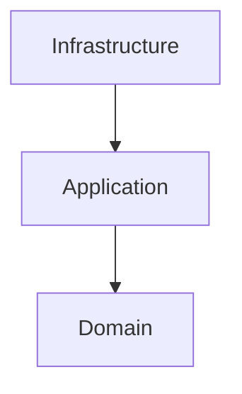

# ADR-005 - Migrating to Hexagonal Architecture

## Status

Accepted

---

## Context

Motor Desk started with a mixed architecture description that used layered and Clean Architecture terminology in the
documentation while the codebase evolved toward explicit domain ports, application use cases, and outer technical
adapters.

Over time, the implementation became more consistent with a hexagonal approach:

- domain ports live under `domain/`;
- use-case implementations live under `application/`;
- technical integrations live under `infrastructure/`;
- the application bootstrap acts as the composition root;
- HTTP controllers remain thin and delegate to use cases.

The project needs its architectural documentation to match the current implementation so that future refactors follow
the same boundary rules and naming conventions.

## Decision

Motor Desk will be documented and maintained as a hexagonal architecture project.

The dependency direction is:

```text
Infrastructure
      ↓
Application
      ↓
Domain
```

The responsibilities are:

- `domain/`: business models, value objects, rules, and ports;
- `application/`: use-case implementations and orchestration;
- `infrastructure/`: HTTP, persistence, messaging, security, external providers, and dependency injection.

The existing ADRs for PostgreSQL, Redis Streams, MongoDB, and Azure Communication Services remain valid. They now sit
inside the hexagonal structure rather than defining the architecture by themselves.

## Architecture



## Consequences

### Positive

- clearer separation of concerns;
- easier reasoning about dependency direction;
- more stable boundaries for refactors;
- simpler testing of use cases and domain rules;
- better alignment between code and documentation.

### Negative

- more explicit module and package organization;
- more mapper and port abstractions where adapters cross boundaries;
- a small amount of documentation and naming cleanup required to keep the architecture consistent.

## Implementation Notes

- keep domain ports in the domain layer;
- keep use-case implementations in the application layer;
- keep Ktor, Exposed, MongoDB, Redis, Azure, and JWT details in infrastructure;
- keep controllers thin and framework-focused;
- keep DI as a composition concern at the application bootstrap.

## Relationship With Other ADRs

This ADR is a structural umbrella for the existing architecture decisions:

- `ADR-001` remains the persistence decision for PostgreSQL and Exposed;
- `ADR-002` remains the asynchronous messaging decision for Redis Streams;
- `ADR-003` remains the history storage decision for MongoDB;
- `ADR-004` remains the email provider decision for Azure Communication Services.

## References

- `README.md` - top-level architecture overview and project structure.
- `docs/Ubiquitous Language.md` - domain vocabulary.
- `docs/storytelling/` - business flows.
- `docs/ADR/ADR-002-Redis-Streams.md` - asynchronous processing.
- `docs/ADR/ADR-003-MongoDB-Service-Order-History.md` - Service Order history.
- `docs/ADR/ADR-004-Azure-Communication-Services-Email.md` - email provider decision.

