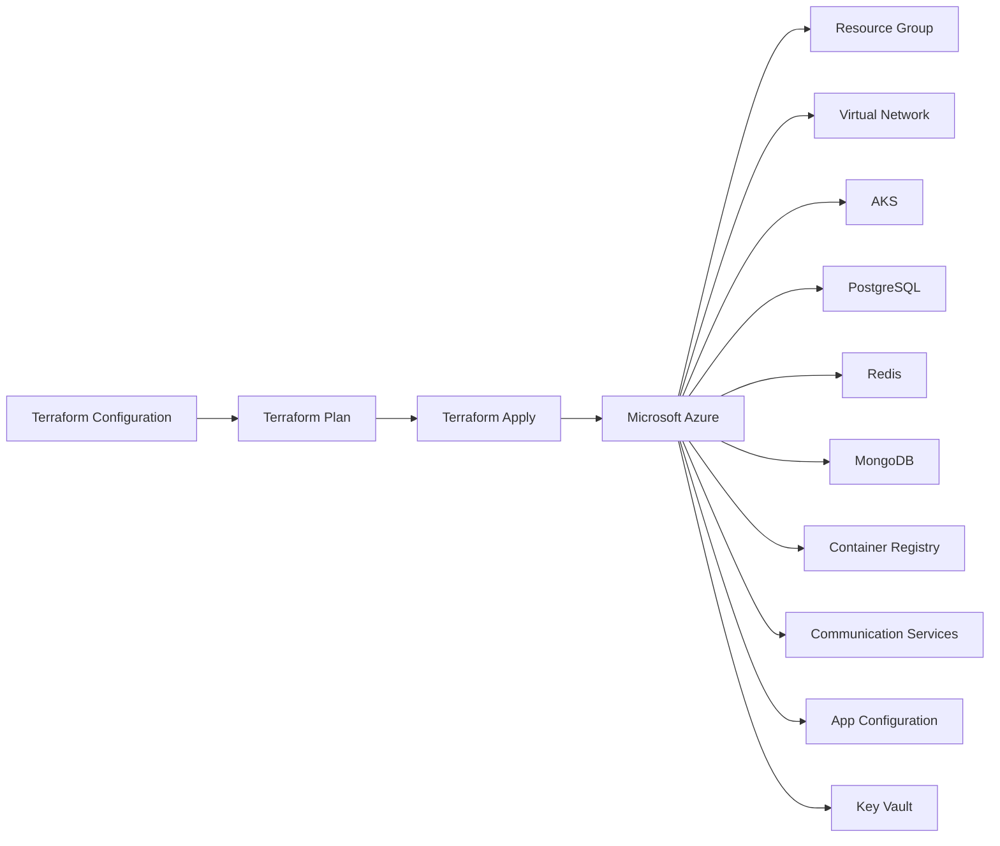
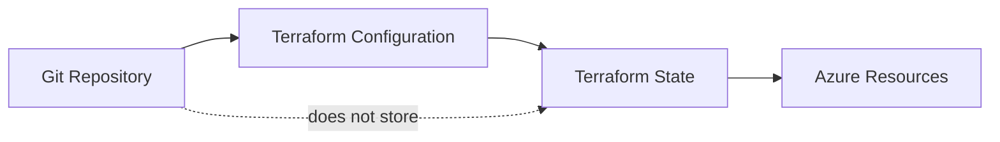
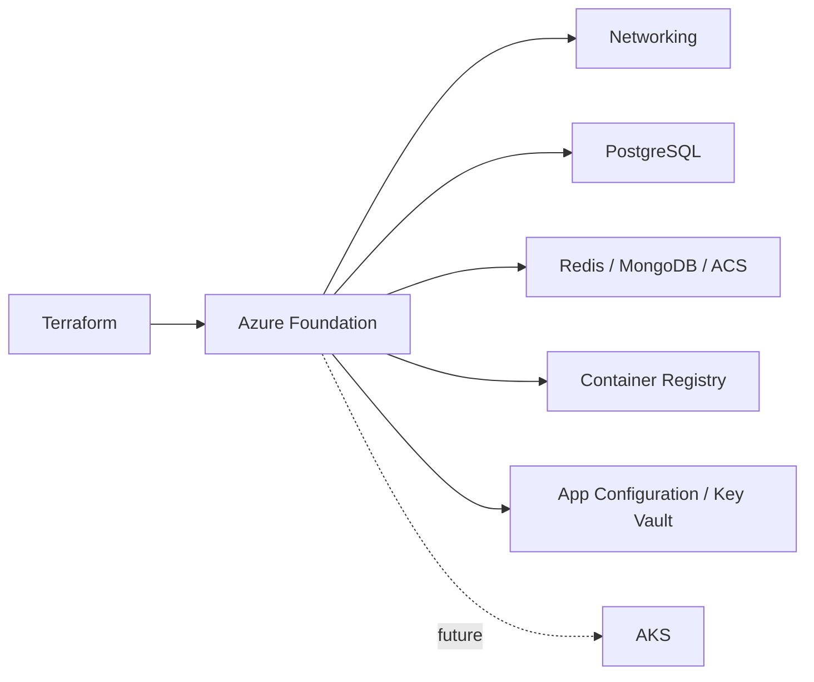

# ADR-006 — Use Terraform and Microsoft Azure for Infrastructure as Code

- **Status:** Accepted
- **Date:** 2026-08-28
- **Decision:** Adopt Terraform as the Infrastructure as Code (IaC) tool and Microsoft Azure as the cloud provider for Motor Desk.

## Context

Motor Desk requires a reproducible and version-controlled way to provision and evolve its cloud infrastructure.

The project is progressively moving infrastructure concerns to Azure, including PostgreSQL Flexible Server, Redis, MongoDB, Azure Container Registry, Azure Communication Services, Azure App Configuration, Azure Key Vault, networking, and the future Azure Kubernetes Service (AKS) cluster.

Managing these resources manually through the Azure Portal would make the environment harder to reproduce, review, and maintain. Infrastructure changes should follow the same engineering workflow as application changes: version control, pull requests, review, and incremental evolution.

## Decision

The project will use **Terraform** as its Infrastructure as Code tool and **Microsoft Azure** as its cloud provider.

Terraform configurations will be maintained in the repository and infrastructure changes will be reviewed through pull requests.

## Why Terraform

Terraform was selected because it provides a declarative approach to infrastructure management.

This provides:

- **Reproducibility:** environments can be provisioned from the same configuration.
- **Version control:** infrastructure changes are tracked alongside application source code.
- **Reviewability:** infrastructure changes can be reviewed through pull requests.
- **Declarative management:** configuration describes the desired infrastructure state.
- **Dependency management:** relationships between resources can be represented explicitly.
- **Incremental evolution:** resources can be added or modified without manually recreating the environment.

Provider configuration and dependency versions will be controlled in the repository.

## Why Microsoft Azure

Microsoft Azure was selected over alternatives such as AWS primarily because the project has access to an **Azure student subscription**.

The student subscription provides access to Azure resources in an academic context, making Azure the most appropriate provider for this project from an accessibility and cost perspective.

This allows the project to:

- use real cloud infrastructure during development and academic delivery;
- provision resources using Terraform;
- experiment with Azure services relevant to the application architecture;
- validate the infrastructure and deployment model in a real cloud environment;
- keep infrastructure costs aligned with the resources available through the student subscription.

The choice of Azure is therefore primarily driven by **availability of the student subscription and its associated resources**, rather than a claim that Azure is technically superior to AWS or other cloud providers for every use case.

## Infrastructure State

Terraform state must not be committed to the Git repository.

For local development, Terraform may use local state. As the infrastructure becomes shared or used by multiple environments, the project should migrate to a remote Terraform backend with appropriate access control and state locking.

## Secrets

Sensitive values must not be hardcoded in Terraform configuration or committed to the repository.

Examples include:

- PostgreSQL administrator passwords;
- application secrets;
- JWT secrets;
- provider credentials.

Secrets should be supplied through variables or an appropriate external secret-management mechanism such as Azure Key Vault.

## Infrastructure Evolution

The infrastructure is expected to evolve incrementally.

The initial implementation does not require every planned Azure resource to be provisioned at once. AKS, for example, can be introduced in a subsequent change while reusing the networking, registry, configuration, and persistence resources already provisioned by Terraform.

## Operational Guidelines

- Infrastructure changes should be represented as Terraform configuration whenever practical.
- Terraform changes should be committed to Git.
- Infrastructure changes should be reviewed through pull requests.
- `terraform plan` should be reviewed before applying changes.
- `terraform apply` should target the intended Azure subscription and environment.
- Terraform state must not be committed to Git.
- Secrets must not be committed as plaintext Terraform variables.
- Provider versions should be controlled through Terraform dependency configuration.
- Terraform modules should only be introduced when they provide meaningful reuse or separation.

## Consequences

### Positive

- Infrastructure becomes reproducible.
- Cloud resources are documented as executable configuration.
- Infrastructure changes become reviewable.
- The Azure environment can evolve incrementally.
- The academic Azure subscription can be used to validate a real cloud deployment.

### Negative

- Terraform introduces an additional tool and configuration language.
- Terraform state must be managed carefully.
- Azure resources can generate costs when they exceed student subscription allowances or available credits.
- Contributors need basic knowledge of Terraform and Azure.
- Some Azure-specific configuration remains necessary.

## Alternatives Considered

### AWS

AWS is a mature cloud provider and would technically support the infrastructure requirements.

It was not selected because the project already has access to an Azure student subscription. Using Azure provides a more accessible academic environment and reduces the barrier to provisioning real cloud resources for the project.

### Manual Azure Portal Provisioning

Rejected because manual provisioning is harder to reproduce, review, document, and evolve consistently.

### Azure CLI Scripts

Rejected as the primary infrastructure mechanism because imperative scripts do not provide the same declarative state-management model required for infrastructure evolution.

### ARM Templates / Bicep

These are valid Azure-native IaC alternatives. Terraform was preferred because the project benefits from a declarative IaC approach while keeping infrastructure definition independent from manual Azure Portal configuration.

## Related Work

- **Issue #14** — Add Terraform scripts to provision cluster and database.
- **PR #40** — Initial Azure Terraform infrastructure.
- **Issue #16** — Kubernetes manifests.
- **Issue #15** — Horizontal Pod Autoscaler.
- **Issue #13** — Database deployment and CI/CD.

## Related Documentation

- `infra/terraform/azure/` — Terraform Azure infrastructure.
- `docs/ADR/` — Architectural Decision Records.
- `docs/diagrams/` — Infrastructure diagrams.
- `README.md` — Project and infrastructure documentation.
- `AGENTS.md` — Project architecture and infrastructure guidelines.
