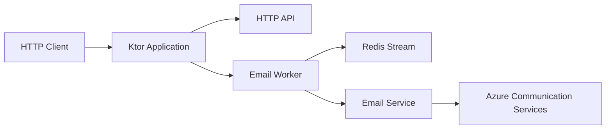
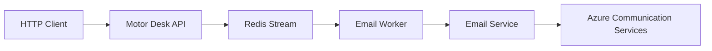
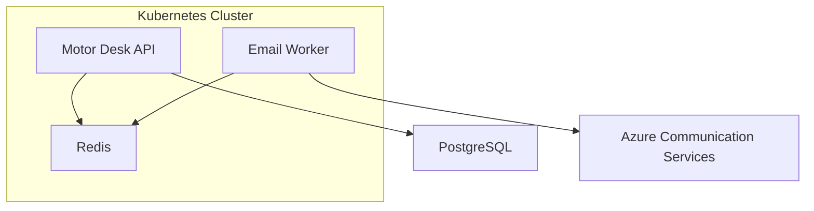
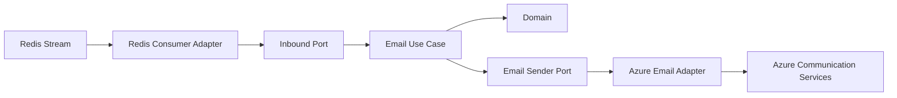
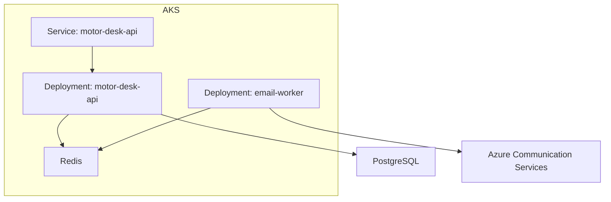
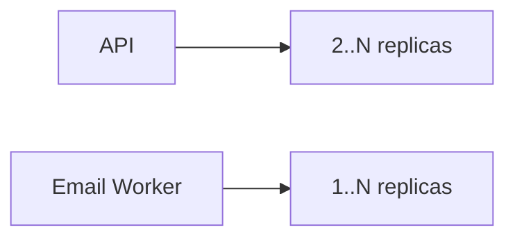
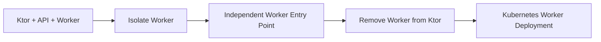
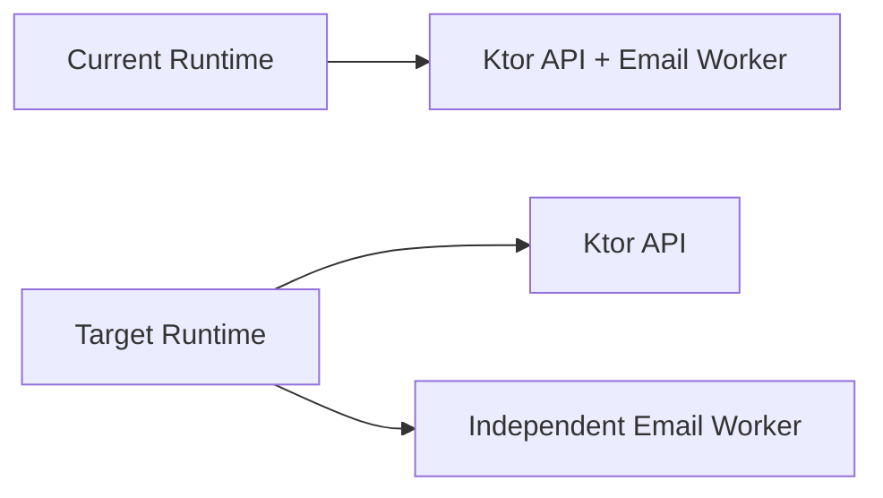

# TD-002 — Decouple Email Worker from Ktor API

* **Status:** Accepted
* **Type:** Technical Debt
* **Priority:** Medium
* **Related Architecture:** Hexagonal Architecture / Ports and Adapters
* **Related Issue:** #14
* **Related Components:** Ktor API, Redis Stream, Email Worker, Azure Communication Services

## Context

The current application executes the email worker within the same Ktor application process.

Although the email processing flow is conceptually separated from the HTTP API, its runtime lifecycle is still coupled
to the Ktor application. The worker is started as part of the same application and therefore cannot currently be
deployed, scaled, or operated as an independent workload.

This creates a limitation for the target Kubernetes architecture, where the HTTP API and asynchronous email processing
should be independently deployable workloads.

The current architecture can be represented as:



The desired architecture is:



In the target architecture, the API and email worker are separate runtime processes and can be deployed as independent
Kubernetes workloads.

## Problem

Keeping the worker inside the Ktor application introduces several limitations:

* API and worker have the same application lifecycle.
* API and worker cannot be scaled independently.
* Worker resource consumption affects the API process.
* Deploying a new API version also requires restarting the worker.
* Kubernetes cannot independently manage the API and worker workloads.
* Worker-specific configuration and operational concerns remain coupled to the HTTP application.
* Failure in the worker runtime can potentially affect the API process.

This coupling is particularly relevant to the planned Kubernetes deployment.

The intended Kubernetes topology is:



## Decision

The email worker should eventually be extracted from the Ktor application and executed as an independent application
process.

The worker should consume email events from Redis and invoke the existing application/domain abstractions required to
send the email.

The extraction should preserve the existing business behavior and ports while changing the runtime composition.

The target structure should resemble:

```text
Motor Desk
├── API Application
│   └── Ktor
│
└── Email Worker Application
    └── Redis Consumer
```

Both applications may share domain and application modules, but their runtime entry points and dependency composition
should remain independent.

## Architectural Boundaries

The worker extraction should preserve the Hexagonal Architecture boundaries.



Infrastructure-specific concerns such as Redis consumers and Azure Communication Services implementations must remain
outside the Domain.

The worker should depend on application ports/use cases rather than directly coupling business logic to Redis or Azure
implementations.

## Proposed Solution

Create a dedicated worker application with its own entry point.

For example:

```text
application/
├── api/
│   └── Application.kt
│
└── email-worker/
    └── Application.kt
```

The exact project/module structure may be adjusted according to the existing Gradle architecture.

The worker application should:

1. Initialize the required dependency injection configuration.
2. Initialize the Redis consumer.
3. Consume email events from the Redis Stream.
4. Resolve the corresponding application use case.
5. Execute the email sending flow.
6. Acknowledge successfully processed messages.
7. Apply the existing retry behavior.
8. Shut down independently from the HTTP API.

The Ktor application should remain responsible for HTTP concerns and should no longer be responsible for starting the
worker.

## Kubernetes Impact

After extraction, the applications can be represented as separate Kubernetes Deployments:



This enables independent scaling:



The worker can therefore be scaled according to email processing demand without increasing the number of HTTP API
instances.

## Migration Strategy

The migration should be incremental.

### Phase 1 — Isolate Worker Composition

Identify the dependencies required exclusively by the worker and move their composition away from the Ktor startup path.

### Phase 2 — Create Worker Entry Point

Create an independent application entry point capable of starting the Redis consumer and required dependencies.

### Phase 3 — Remove Worker Startup from Ktor

Once the independent worker is operational, remove worker initialization from the Ktor application.

### Phase 4 — Create Kubernetes Workload

Create a dedicated Kubernetes Deployment for the worker.



## Acceptance Criteria

* [ ] Email worker can start independently from Ktor.
* [ ] Email worker has its own application entry point.
* [ ] Ktor application no longer starts the email worker.
* [ ] Worker can consume Redis events without starting the HTTP server.
* [ ] Worker uses the existing application/domain ports and use cases.
* [ ] Redis-specific concerns remain isolated in infrastructure adapters.
* [ ] Azure Communication Services integration remains isolated behind the appropriate port/adapter.
* [ ] Existing retry and message acknowledgement behavior is preserved.
* [ ] API and worker can be built and executed independently.
* [ ] Worker can be deployed as an independent Kubernetes Deployment.
* [ ] API and worker can be scaled independently.
* [ ] Existing email processing tests continue to pass.
* [ ] Documentation and architecture diagrams are updated after extraction.

## Consequences

### Positive

* API and worker have independent lifecycles.
* Kubernetes can manage them as separate workloads.
* API and worker can scale independently.
* Worker failures are isolated from the HTTP API process.
* Worker-specific configuration becomes easier to manage.
* The runtime architecture better reflects the asynchronous nature of email processing.

### Negative

* The project will have an additional application/runtime.
* Dependency injection configuration may need to be shared or reorganized.
* Build and deployment configuration becomes more complex.
* Local development requires starting two processes when both API and worker are needed.
* Additional Kubernetes configuration will be required.

## Relation to Current Architecture

This technical debt does not change the architectural direction defined by the project's Hexagonal Architecture
decision.

Instead, it represents a remaining implementation gap between the current runtime structure and the desired
architecture.



The goal is therefore not to introduce a new email processing architecture, but to **complete the runtime separation
required to fully realize the existing architectural model**.

## Related Documentation

* `docs/ADR/` — Architectural Decision Records.
* `AGENTS.md` — Project architecture and development guidelines.
* Email flow documentation — Redis Stream and Azure Communication Services integration.
* Kubernetes documentation — Deployment and workload configuration.

## Related Work

* **Issue #14** — Azure infrastructure and Kubernetes cluster.
* **Issue #15** — Horizontal Pod Autoscaler.
* **Issue #16** — Kubernetes manifests.
* **Issue #26** — Email integration.
* **Issue #31** — Email notification flow.
* **Issue #33** — Redis/application architecture improvements.
