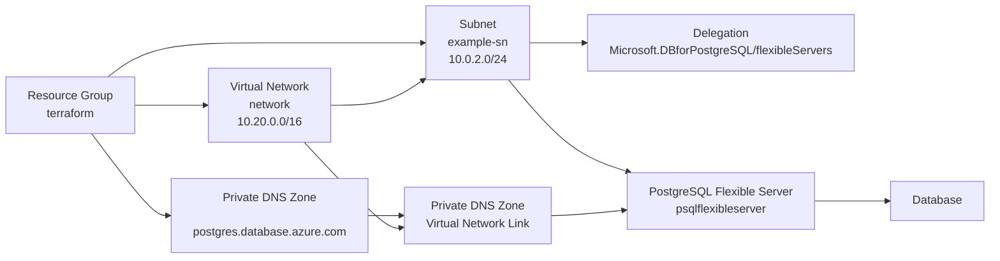

```mermaid
flowchart LR
    RG[Resource Group\nterraform]
    VNET[Virtual Network\nnetwork\n10.20.0.0/16]
    SUBNET[Subnet\nexample-sn\n10.0.2.0/24]
    DELEGATION[Delegation\nMicrosoft.DBforPostgreSQL/flexibleServers]
    DNS[Private DNS Zone\n postgres.database.azure.com]
    LINK[Private DNS Zone\nVirtual Network Link]
    PG[PostgreSQL Flexible Server\n psqlflexibleserver]
    DB[Database\n]
    RG --> VNET
    RG --> SUBNET
    RG --> DNS
    VNET --> SUBNET
    SUBNET --> DELEGATION
    SUBNET --> PG
    DNS --> LINK
    VNET --> LINK
    LINK --> PG
    PG --> DB
```
