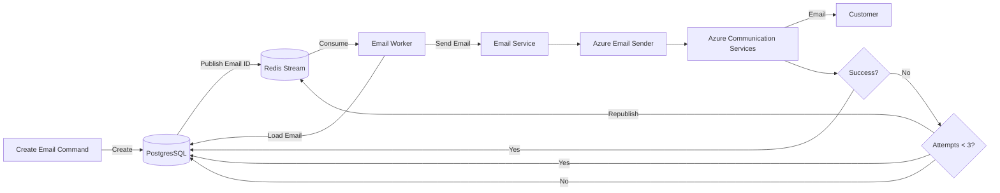

```mermaid
flowchart LR
    A[Create Email Command]
    B[(PostgresSQL)]
    C[(Redis Stream)]
    D[Email Worker]
    E[Email Service]
    F[Azure Email Sender]
    G[Azure Communication Services]
    H[Customer]

    A -->|Create| B
    B -->|Publish Email ID| C
    C -->|Consume| D

    D -->|Load Email| B
    D -->|Send Email| E
    E --> F
    F --> G
    G -->|Email| H

    G --> I{Success?}

    I -->|Yes| B
    I -->|No| J{Attempts < 3?}

    J -->|Yes| B
    J -->|Republish| C
    J -->|No| B
```