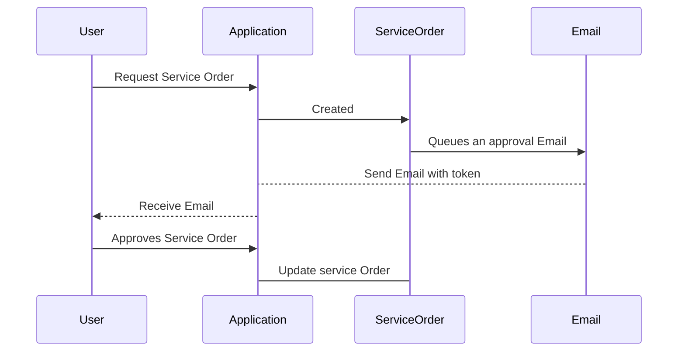

```mermaid
sequenceDiagram
    participant U as User
    participant A as Application
    participant S as ServiceOrder
    participant E as Email

    U->>A:Request Service Order
    A->>S:Created
    S->>E:Queues an approval Email
    E-->A:Send Email with token
    A-->>U:Receive Email
    U->>A:Approves Service Order
    A->S: Update service Order
```